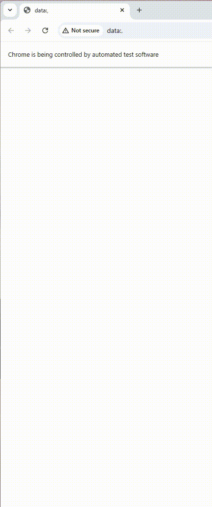

# Python Web Tests - Twitch Mobile Automation

Selenium-based tests for the Twitch mobile web app using Python, pytest, and a Page Object Model.

## Demo



## Run Tests

Prereqs: Python 3.8+, Chrome.

```bash
python -m venv venv
venv\Scripts\activate
pip install -r requirements.txt
pytest
```

## Project Structure

```
config/    app settings and device profiles
drivers/   WebDriver factory
pages/     page objects
tests/     pytest tests and fixtures
utils/     helpers (screenshots, highlighting)
reports/   generated reports
screenshots/ generated images
```
